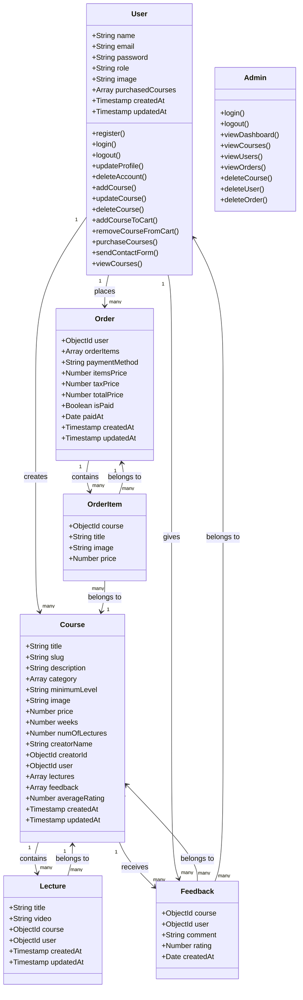

# Learnify E-Learning Platform

## Project Overview
Learnify is an e-learning platform where users can browse diverse courses, enroll, and even share their own courses. Built with Node.js, Express.js, MongoDB, React.js + Vite, TailwindCSS and DaisyUI.

## Features

### Admin:
- Login
- Logout
- Manage Courses:
  - Delete Course
- Manage Users:
  - Delete User
- Manage Orders:
  - Delete Order

### Student:
- Login
- Register
- Change Password
- Logout
- Manage Own Courses:
  - Add Course
  - Edit Course
  - Delete Course
- Manage Own Lectures for course:
  - Add Lectures
  - Edit Lectures
  - Delete Lectures
- Update Profile
- Delete Account
- Payment Method for Subscription:
  - PayPal or Credit Card (mock payment)


### Additional Features:
- Allow Students to Give Feedback on Courses
- Notifications for Updates on Course Activities
- Subscriptions Email
- Contact Us Form (accessible by logged-in users and visitors)

## Tech Stack

### Backend:
- [Node.js](https://nodejs.org/en)
- [Express.js](https://expressjs.com/)
- [MongoDB](https://www.mongodb.com/products/platform/atlas-database)

### Frontend:
- [React.js + Vite](https://vitejs.dev/guide/)
- [TailwindCSS](https://tailwindcss.com/docs/guides/vite)
- [DaisyUI](https://daisyui.com/)

## Dependecies used:

### Backend:
- [aws-sdk/client-s3](https://www.npmjs.com/package/@aws-sdk/client-s3)
- [aws-sdk/lib-storage](https://www.npmjs.com/package/@aws-sdk/lib-storage)
- [bcryptjs](https://www.npmjs.com/package/bcryptjs)
- [colors](https://www.npmjs.com/package/colors)
- [cors](https://www.npmjs.com/package/cors)
- [cookie-parser](https://www.npmjs.com/package/cookie-parser)
- [express](https://www.npmjs.com/package/express)
- [express-rate-limit](https://www.npmjs.com/package/express-rate-limit)
- [jsonwebtoken](https://www.npmjs.com/package/jsonwebtoken)
- [mongoose](https://www.npmjs.com/package/mongoose)
- [multer](https://www.npmjs.com/package/multer)
- [multer-s3](https://www.npmjs.com/package/multer-s3)
- [nodemailer](https://www.npmjs.com/package/nodemailer)
- [slugify](https://www.npmjs.com/package/slugify)

### Frontend:
- [tailwindCSS](https://tailwindcss.com/docs/guides/vite)
- [DaisyUI](https://daisyui.com/docs/install/)
- [@reduxjs/toolkit](https://www.npmjs.com/package/@reduxjs/toolkit)
- [axios](https://www.npmjs.com/package/axios)
- [react-router-dom](https://www.npmjs.com/package/react-router-dom)
- [react-icons](https://www.npmjs.com/package/react-icons)
- [react-redux](https://www.npmjs.com/package/react-redux)
- [react-toastify](https://www.npmjs.com/package/react-toastify)

## To run backend:
```
# update scripts in package.json:
"scripts": {
    "start": "node --env-file=.env server.js",
    "dev": "node --watch --env-file=.env server.js"
  },
``` 
```
# Run in dev mode
npm run dev

# Run in prod mode
npm start
```
## To run frontend:
```
# Run in dev mode
npm run dev
```
## To run both frontend and backend:
install [concurrently
](https://www.npmjs.com/package/concurrently)
```
# update scripts in package.json:
"scripts": {
    "start": "node --env-file=.env backend/server.js",
    "dev": "node --watch --env-file=.env backend/server.js",
    "concurrently": "concurrently \"cd backend && npm run dev\" \"cd frontend && npm run dev\""
  },
```
```
# run
npm run concurrently
```

# Learnify Project

## File Structure

```plaintext
Learnify/
├── backend/
│   ├── config/
│   ├── controllers/
│   ├── middleware/
│   ├── models/
│   ├── routes/
│   ├── utils/
│   ├── server.js
│
├── frontend/
│   ├── public/
│   ├── src/
│   │   ├── assets/
│   │   ├── components/
│   │   ├── utils/
│   │   ├── layout/
│   │   ├── pages/
│   │   ├── Redux/
│   │   ├── App.jsx
│   │   ├── index.css
│   │   ├── main.jsx
│   ├── tailwind.config.js
│   ├── vite.config.js
│   ├── package.json
│   ├── README.md
├──.env
├── package.json

```

## Class Diagram


