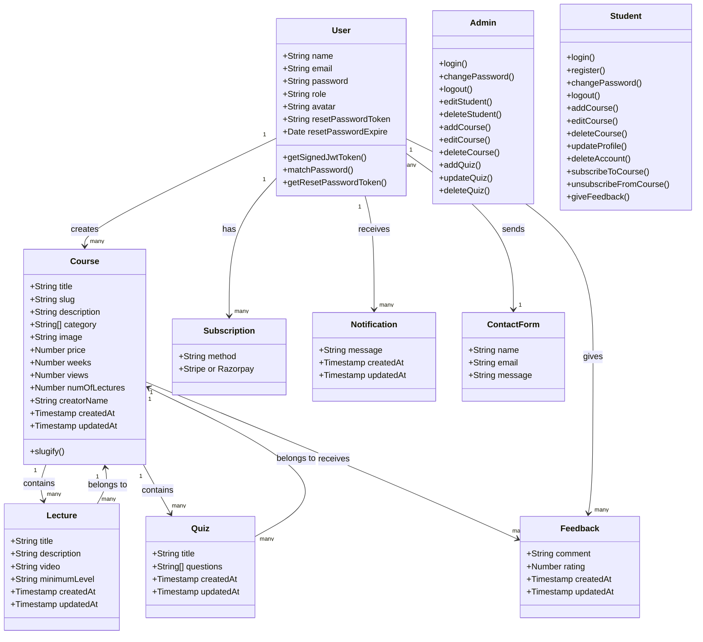

# Learnify E-Learning Platform

## Project Overview
Learnify is an e-learning platform where users can browse diverse courses, enroll, and even share their own courses. Built with Node.js, Express.js, MongoDB, React.js, and TailwindCSS.

## Features

### Admin:
- Login
- Change Password
- Logout
- Manage Students:
  - Edit Student
  - Delete Student
- Manage Courses:
  - Add Course
  - Edit Course
  - Delete Course
- Manage Quizzes:
  - Add Quiz for a Course
  - Update Quiz
  - Delete Quiz

### Student:
- Login
- Register
- Change Password
- Logout
- Manage Own Courses:
  - Add Course
  - Edit Course
  - Delete Course
- Update Profile
- Delete Account
- Subscribe to Courses
- Unsubscribe from Courses
- Payment Method for Subscription:
  - Stripe or
  - PayPal or
  - Razorpay


### Additional Features:
- Allow Students to Give Feedback on Courses
- Notifications for Updates on Course Activities
- Subscriptions Email
- Contact Us Form on the Landing Page (accessible by logged-in students and visitors)

## Tech Stack

### Backend:
- Node.js
- Express.js
- MongoDB

### Frontend:
- React.js
- TailwindCSS

## Dependecies used:

### Backend:
- [bcryptjs](https://www.npmjs.com/package/bcryptjs)
- [colors](https://www.npmjs.com/package/colors)
- [cookie-parser](https://www.npmjs.com/package/cookie-parser)
- [cors](https://www.npmjs.com/package/cors)
- [express](https://www.npmjs.com/package/express)
- [express-mongo-sanitize](https://www.npmjs.com/package/express-mongo-sanitize)
- [express-rate-limit](https://www.npmjs.com/package/express-rate-limit)
- [helmet](https://www.npmjs.com/package/helmet)
- [hpp](https://www.npmjs.com/package/hpp)
- [jsonwebtoken](https://www.npmjs.com/package/jsonwebtoken)
- [mongoose](https://www.npmjs.com/package/mongoose)
- [morgan](https://www.npmjs.com/package/morgan)
- [nodemailer](https://www.npmjs.com/package/nodemailer)
- [slugify](https://www.npmjs.com/package/slugify)
- [xss-clean](https://www.npmjs.com/package/xss-clean)

### --watch flag: restarts the process when an imported file is changed(available for Node.js version 18 and up) used instead of nodemon, only add command it to package.json 
- reference: [Good bye, Nodemon](https://vazgen6.medium.com/goodbye-nodemon-693a2c9b370c)
  
### --env-file=env: to load environment variables, used instead of dotenv(available for Node.js version 20.6.0+), only add command to package.json 
- reference: [Stop using dotenv in Node.js](https://medium.com/@tony.infisical/stop-using-dotenv-in-node-js-v20-6-0-8febf98f6314)

```
"scripts": {
    "start": "node --env-file=.env server.js",
    "dev": "node --watch --env-file=.env server.js"
  },
```  

## To run backend:
```
# Run in dev mode
npm run dev

# Run in prod mode
npm start
```

# Learnify Project

## File Structure

```plaintext
Learnify/
├── backend/
│   ├── config/
│   ├── controllers/
│   ├── middleware/
│   ├── models/
│   ├── routes/
│   ├── utils/
│   ├── server.js
│   ├── .env
│   ├── package.json
│
├── frontend/
│   ├── public/
│   ├── src/
│   │   ├── assets/
│   │   ├── components/
│   │   ├── helpers/
│   │   ├── layout/
│   │   ├── pages/
│   │   ├── Redux/
│   │   ├── App.jsx
│   │   ├── index.css
│   │   ├── main.jsx
│   ├── .env
│   ├── package.json
│   ├── README.md

```

## Class Diagram


